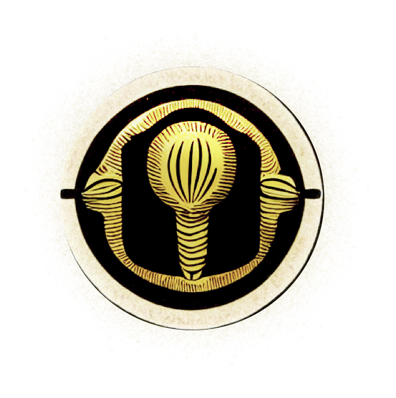

# scilaunch

A tiny program for you that lays the foundation for great discoveries.




`[Last update 2023-10-05 | v.0.1.5]`

## Description

`scilaunch` helps you to set up your research project:

1. create a canonical directory structure tailored for research projects

2. for python users it offers to set up a `conda` environment

3. it prepares your research code as `python` package ready for `import`

4. and `scilaunch` can init your `git` repository

---

The project structure can be occupied with other programming languages (`R`, `matlab`, etc.) as well.

`scilaunch` is a wrapper around the great [`cookiecutter`](https://github.com/cookiecutter/cookiecutter) package and is mainly build around this template: [research-project](https://github.com/SHEscher/research-project).

## Getting started

### Install `scilaunch`

Ideally install `scilaunch` into your global/base `python` environment, which should be `python>=3.8`.

```shell
pip install -U git+https://github.com/SHEscher/scilaunch.git
```

It is also recommended to have `conda` installed.

### Run `scilaunch`

Simply run `scilaunch` via the command line:

```shell
scilaunch PARENT/DIR/OF/YOUR/RESEARCH/PROJECT
# OR cd into the parent dir and just run `scilaunch`
```

Then, you will be asked to provide some information relevant to your project.


When running `scilaunch` the first time, you will set some default values, which will ease your life for upcoming launches of research projects.

You can still change these default values in `~/.cookiecutterrc` at a later stage.

## Cookiecutter templates

You can also fork / adopt the underlying `research-project` template for `scilaunch` from here: https://github.com/SHEscher/research-project. This template works also directly with `cookiecutter`.

To build your own templates, check out the `cookiecutter` [docs](https://cookiecutter.readthedocs.io/en/stable/index.html#).

Here you can find also more information on the `~/.cookiecutterrc`

## TODO's

- [ ] allow to pass other `cookiecutter` templates
- [ ] push to `pypi` (this is currently requested under following [issue](https://github.com/pypi/support/issues/3009#issue-1801180281))
